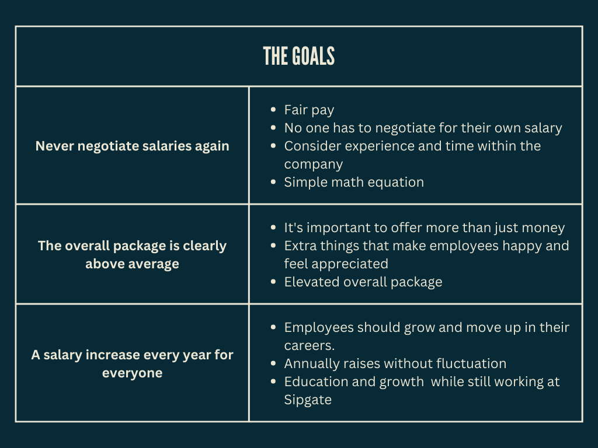

# SALARY SYSTEMS FOR BUFFER AND SIPGATE

<!-- .slide: data-background="./pexels-tima-miroshnichenko-6693655.jpg" -->

---

Yasmine Serghini

2023-05-10

---

# Agenda

- #### Who?
- #### Buffer´s salary formula
- #### Key principles
- #### Disadvantages & Feedback
- #### Sipgate´s salary framework
- #### Components
- #### Disadvantages & Feedback

<!-- .slide: data-background="./Background Agenda.jpg" -->

---

## Who?

---

## Buffer

Buffer is a super cool website that helps people manage their social media.
But what's even cooler is their pay system - everyone knows how much everyone else makes!

The whole team gets together to talk about pay and give their thoughts.

---

Buffer's salary formula is like a math equation:

JOB

EXPERIENCE

LOCATION

 

Each of these things gets a number, and we add them together to get your salary.
This way, everyone who has similar skills and experience gets paid similarly.

---

### Key principles for compensation and benefits

---

### Salary formula

<small>source: https://buffer.com/salaries</small>

---

### The Buffer Salary calculator

### How much would you make?

 
Use the company´s calculator to see what your salary would be at Buffer or figure out what a fair salary is for your job and where you live.

---

---

### Disadvantages of the system

 

Complexity

Biases

Limited room for negotiation

 

Lack of flexibility

Potential for dissatisfaction

---

Buffer's salary system is pretty awesome, but it might not be right for everyone.
 

 
Every company and employee is different, so there might be some challenges or limitations to the system. Before using it, it's important to think about these things and make sure it's a good fit for you!

---

### Feedback

Buffer is all about being open and honest, especially when it comes to pay!  

 
Some of the team members have shared what they think about the salary system, and it's been a mix of responses.

---

---

## Sipgate

Sipgate is a telecommunications company based in Germany that offers an awesome service that lets you talk to people over the internet.

 

|       Basic       |      Benefits      |
| :---------------: | :----------------: |
| Good compensation |  Health insurance  |
|      Bonuses      | Flexible schedules |
|                   |  Retirement plans  |

---

### The Lean Salary Framework

 

The model was officially introduced with the salary round in summer 2016. Since then, it has undergone several major revisions.

---

---

### The model

Set of criteria

Ensure fair pay

 

Formulated into a tool

 

Treat everyone equally

 

Standardization and automation

---

To **continually improve** the salary model, the company reviews the criteria annually, and updates the formula accordingly. Each year, **a new version number** is assigned to the model to reflect its limited validity.

 

For example, the current salary model 2022 will remain valid until December 31, 2022.

---

### Components

|:----------------------:|:---------------------:|:---------------------:|:-------------------------------------:|:---------------------:|
| [RF](Role%20Factor.png)|  |  |  |  |

---

### Disadvantadge of the model

A disadvantage of a formula in general is that it tempts one to make assumptions about its future dynamics. It looks as if the formula already predicts what everyone will earn in five or ten years from now. This is wrong.

---

source: https://sipgate.medium.com/so-zahlen-wir-6251ec42205a

---

Sipgate's salary model aims to provide fairness for today and considers the past but is not suitable for predicting future salary developments. The future salary development is unknown, and it will inevitably contain jumps. The salary round of 2017/18 saw over 70% of all employees receiving significant increases that exceeded expected increases based on the previous year's formula. Working with their salary model obliges them to review and change variables every year, resulting in more dynamics than the formula suggests.

---

### Fails

- Including a market premium for developers with an informatics diploma, which made it seem like Sipgate viewed other educational paths as inferior
- Not factoring in personal educational paths, resulting in unequal pay for colleagues with the same job
- Clearly communicate that the formula is unsuitable for predicting future salaries, leading to misunderstandings and complaints

Sipgate corrected these mistakes in later versions of their salary model.

---

### Feedback

Overall, Sipgate's salary model was positively received when it was introduced in 2016. Many employees were relieved to finally understand how their personal salary was composed, and the fairness and automatic annual salary increases for everyone were praised. However, there was also a lot of criticism. Sipgate advises that the introduction of a salary model should not be seen as a completed project, but rather an ongoing process of explaining, defending, and continuously developing the model over the next few years.

---

# Comparison?

---

## Sources

<small>
<ul>
<li>https://buffer.com/salaries</li>
<li>https://sipgate.medium.com/so-zahlen-wir-6251ec42205a</li>
<li>https://buffer.com/resources/</li>
<li>https://hbr.org/2016/12/buffers-radical-transparency-can-it-work-for-your-company</li>
<li>https://www.businessinsider.com.au/how-buffer-salary-formula-works-2015-8</li>
<li>https://www.fastcompany.com/3059627/why-buffer-is-paying-all-employees-the-same-salary</li>
<li>https://www.glassdoor.com/Reviews/Buffer-Reviews-E941992.htm</li>
</ul>
</small>

---

# Thank you! &#10084;

<!-- .slide: data-background="./pexels-tima-miroshnichenko-6693655.jpg" -->
