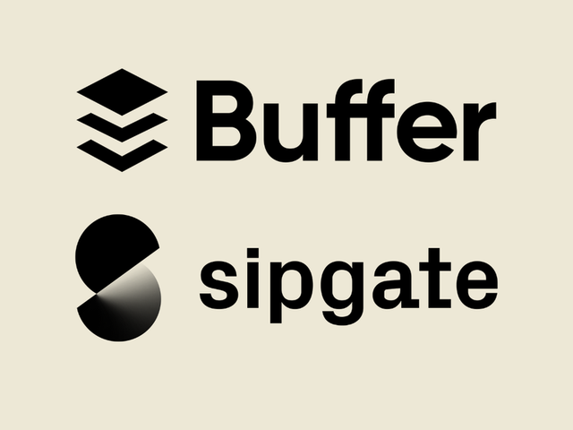

# SALARY SYSTEMS FOR BUFFER AND SIPGATE

<!-- .slide: data-background="./pexels-tima-miroshnichenko-6693655.jpg" -->

---

Yasmine Serghini

2023-05-10

---

# Agenda

- #### Who?
- #### Buffer´s salary formula
- #### Key principles
- #### Disadvantages & Feedback
- #### Sipgate´s salary framework
- #### Components
- #### Disadvantages & Feedback

<!-- .slide: data-background="./Background Agenda.jpg" -->

---

## Who?

---

## Buffer

Buffer is a super cool website that helps people manage their social media. But what's even cooler is their pay system - everyone knows how much everyone else makes! The whole team gets together to talk about pay and give their thoughts.

Buffer has changed the way they pay their team over the years, making it simpler and more in line with what other companies are doing. Now, they're working on making it even better for people who work from home. Exciting right?

---

Buffer's salary formula is like a math equation that considers a few things, like the job you do, how much experience you have, and where you live.
Each of these things gets a number, and we add them together to get your salary! This way, everyone who has similar skills and experience gets paid similarly. They're obviously also checking to make sure they pay their team what they deserve!

---

One notable feature of Buffer's salary system is its transparency. They're super open about salaries and tell everyone how much everyone else makes, so there are no secrets. This way, everyone knows they're being paid fairly and can talk about pay without feeling weird. It's like having an open book - they want everyone to trust each other and be open about money!

---

### Key principles for compensation and benefits

---

### Salary formula

<small>source: https://buffer.com/salaries</small>

---

### The Buffer Salary calculator

### How much would you make?

 
Use the company´s calculator to see what your salary would be at Buffer or figure out what a fair salary is for your job and where you live.

---

---

### Disadvantages of the system

 

Complexity

Biases

Limited room for negotiation

 

Lack of flexibility

Potential for dissatisfaction

---

Buffer's salary system is pretty awesome, but it might not be right for everyone.
 

 
Every company and employee is different, so there might be some challenges or limitations to the system. Before using it, it's important to think about these things and make sure it's a good fit for you!

---

### Feedback

Buffer is all about being open and honest, especially when it comes to pay!  

 
Some of the team members have shared what they think about the salary system, and it's been a mix of responses.

---

---

## Sipgate

Sipgate is a telecommunications company based in Germany that offers voice over IP (VoIP) services to individuals and businesses. Sipgate has a competitive compensation package that includes a base salary, performance-based bonuses, and benefits such as health insurance, retirement savings plans, and flexible work arrangements.

---

Sipgate is known for its employee-centric culture, and it is likely that the company values fair compensation and transparency in its salary system. Sipgate has also been recognized as a top employer in Germany, which suggests that it provides a positive work environment and opportunities for professional development.

---

### The Lean Salary Framework

The model was officially introduced with the salary round in summer 2016. Since then, it has undergone several major revisions.

---

### The Goals

#### Never negotiate salaries again

At Sipgate, compensation is determined by the market value of a particular role, rather than an individual's negotiating skills - there are no individual salary negotiations. However, every employee receives a salary that is based on their individual experience and tenure with the company. Similar work is compensated similarly, but with consideration for individual experience and time spent with the company. Additionally, compensation is calculated each year using a simple formula based on objective criteria.

---

#### The overall package is clearly above average

At Sipgate, the company believes that a well-rounded compensation package is important for employees. While compensation is market-based and is expected to align with what is typically paid for a particular role and corresponding experience, it is just one component of the overall package. The company offers additional perks and benefits beyond salary to make the overall compensation package clearly above average.

---

#### A salary increase every year. For everyone.

Sipgate aims to foster career growth and provide employees with a clear path for advancement. To that end, every employee should receive a salary increase every year, without having to look for opportunities elsewhere. This ensures that everyone has the chance to progress and continually improve their skills while remaining with the company.

---

### The model

The salary model is based on a set of criteria defined by the company to ensure fair pay for all employees. These criteria have been formulated into a tool that helps determine current salaries for all staff members. By using this formula, the company is able to treat everyone equally and saves time through standardization and automation.

---

To continually improve the salary model, the company reviews the criteria annually, and updates the formula accordingly. Each year, a new version number is assigned to the model to reflect its limited validity. For instance, the current salary model 2022 will remain valid until December 31, 2022.

---

### Components

#### Role factor

The company determines the Role Factor for each role through research. They collect typical starting salaries for each role by looking at currently paid average annual salaries for employees with 0-2 years of experience in the market. This information is obtained through publicly available studies, market overviews, and salary expectations of applicants. The Role Factors are then set in a way that, multiplied by the Location Points and currency factor, results in a typical starting salary.

---

The Role Factors are set anew each year, and an increase results in a salary increase for all employees in that role. The company also has a Role Fixum, which is a fixed amount added to all members of a role, currently set at +1000 EUR. The company's salary model is prepared for multiple locations, including abroad and with other currencies if necessary.

---

#### Loyalty

The Loyalty factor is initially 1.8% of the Base per full year of seniority at sipgate, but decreases to 1.2% after 10 years. Seniority is calculated based on the number of years and months an employee has worked in a permanent position at sipgate, excluding interruptions. Parental leave of up to one year per child or sabbaticals do not count as interruptions and are fully credited towards seniority.

---

#### Experience

Relevant professional experience refers to the number of years and months worked in the current role, regardless of the company. Side jobs, temporary employment, or non-relevant part-time or full-time employment are not counted. Interruptions such as a sabbatical or taken parental leave of up to one year per child are fully credited. Experience creates a "curve" that reflects the average salary development in the market. In the first year, the resulting increase in comparison to the previous year from experience is 6% on the Base, 4.5% after 5 years, and 2.6% after 10 years.

---

#### Personal education path

At sipgate, salaries are aimed to be set at the level of a university graduate in the market, regardless of whether someone has a degree or not. Adjustments are made for those who have pursued higher education to ensure fair compensation, as they accumulate less loyalty and experience than their peers who did not pursue higher education. Fixed surcharges are added to the salary formula for a bachelor's or pre-diploma (+2000 EUR) and a master's or diploma (+4000 EUR) degree, as long as there is an actual loss of time regarding loyalty and experience due to studies.

---

#### Supplements for Availability

The availability community at sipgate is crucial for ensuring the 24/7 elimination of faults. These employees have a broad understanding of a diverse system landscape and contribute to reducing outages and improving communication. Supplements for availability are €62.64/day and €125.28/weekend and holiday in 2020. For those who need to reach the Düsseldorf readiness location quickly, the supplements are 5% higher. The supplements for readiness increase by 2.2% annually on July 1, based on the 2018 values.

---

### Disadvantadge of the model

A disadvantage of a formula in general is that it tempts one to make assumptions about its future dynamics. It looks as if the formula already predicts what everyone will earn in five or ten years from now. This is wrong.

---

source: https://sipgate.medium.com/so-zahlen-wir-6251ec42205a

---

Sipgate's salary model aims to provide fairness for today and considers the past but is not suitable for predicting future salary developments. The future salary development is unknown, and it will inevitably contain jumps. The salary round of 2017/18 saw over 70% of all employees receiving significant increases that exceeded expected increases based on the previous year's formula. Working with their salary model obliges them to review and change variables every year, resulting in more dynamics than the formula suggests.

---

### Fails

- Including a market premium for developers with an informatics diploma, which made it seem like Sipgate viewed other educational paths as inferior
- Not factoring in personal educational paths, resulting in unequal pay for colleagues with the same job
- Clearly communicate that the formula is unsuitable for predicting future salaries, leading to misunderstandings and complaints

Sipgate corrected these mistakes in later versions of their salary model.

---

### Feedback

Overall, Sipgate's salary model was positively received when it was introduced in 2016. Many employees were relieved to finally understand how their personal salary was composed, and the fairness and automatic annual salary increases for everyone were praised. However, there was also a lot of criticism. Sipgate advises that the introduction of a salary model should not be seen as a completed project, but rather an ongoing process of explaining, defending, and continuously developing the model over the next few years.

---

# Comparison?

---

## Sources

<small>
<ul>
<li>https://buffer.com/salaries</li>
<li>https://sipgate.medium.com/so-zahlen-wir-6251ec42205a</li>
<li>https://buffer.com/resources/</li>
<li>https://hbr.org/2016/12/buffers-radical-transparency-can-it-work-for-your-company</li>
<li>https://www.businessinsider.com.au/how-buffer-salary-formula-works-2015-8</li>
<li>https://www.fastcompany.com/3059627/why-buffer-is-paying-all-employees-the-same-salary</li>
<li>https://www.glassdoor.com/Reviews/Buffer-Reviews-E941992.htm</li>
</ul>
</small>

---

# Thank you! &#10084;

<!-- .slide: data-background="./pexels-tima-miroshnichenko-6693655.jpg" -->
